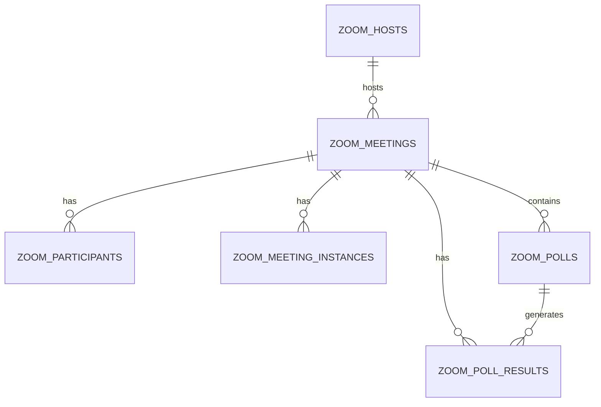
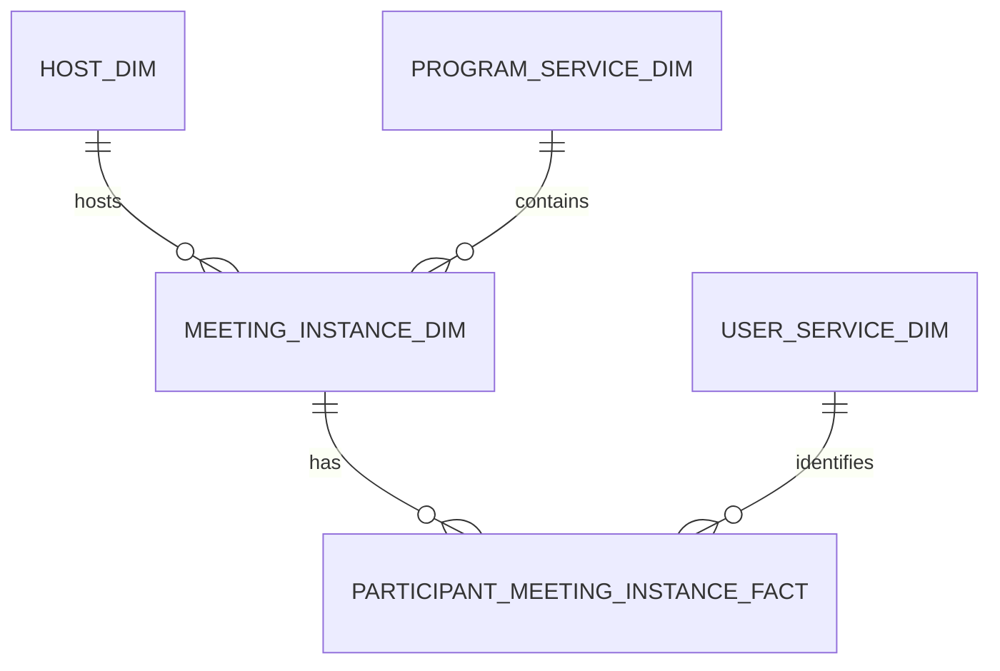

# Attendance Service Data Models

## Data Sources

1. **Program Service**:
    - Source: Program service PostgreSQL database
    - We get from the silver layer, program and lesson information

2. **Zoom Data**:
    - Contains attendee information, join/leave times
    - Reference: [Zoom API Documentation](https://developers.zoom.us/docs/api/rest/reference/zoom-api/methods/#operation/meetings)

3. **User Service**:
    - Source: User service MongoDB database
    - Contains user mappings and authentication information

## Known Limitations
1. Zoom data freshness depends on API sync frequency
2. Only meetings longer than 20 minutes and with more than 30% of fellow attendance are considered valid
3. Participant data may be incomplete for non-authenticated users
4. Is possible to have multiple device logins, we try our best to consolidate
5. Poll results may be incomplete for anonymous participants
6. Historical poll data might not be available for all meetings
7. For some API endpoints, we are unable to get data from more than 1 year

## Source schemas
- `raw_data.video_platform__source`

## Source ERD

## Bronze Layer

### Models
- brz_scraper_zoom__meetings
- brz_scraper_zoom__meeting_instances
- brz_scraper_zoom__participants
- brz_scraper_zoom__hosts
- brz_scraper_zoom__polls
- brz_scraper_zoom__poll_results

### How are models built?
Models are built using direct table extraction from the Zoom API data in `raw_data.video_platform__source`. Each model:
1. Filters data by specific `endpoint_url` value (e.g., 'users' for hosts, 'polls' for polls)
2. Uses JSON_VALUE/JSON_QUERY to extract fields from the JSON data column
3. Casts fields to appropriate data types where needed
4. Includes execution_date from source for tracking

## Silver Layer

### Models
- slv_attendance__participant_meeting_instance_fact
- slv_attendance__meeting_instance_dim
- slv_attendance__host_dim

### ERD

### How are models built?
Models are built by:
1. Taking the most recent execution_date from Zoom data
2. Joining with user service data for consistent user identification
3. Creating dimensional models for hosts, meetings, and participants
4. Linking with program service for lesson and program information
5. Calculating attendance metrics including duration and status

### Key Model Details

#### participant_meeting_instance_fact
- Records individual attendance sessions with join/leave times
- Links participants to both meeting instances and user service IDs
- Includes participant status
- Tracks failover events and duration in seconds
- Maintains original participant details (name, email) for verification

#### meeting_instance_dim
- Contains meeting metadata (topic, type, URL)
- Tracks start and end times in consistent timezone
- Records participant counts and meeting duration
- Links to program and lesson information
- Includes meeting source and host information

#### host_dim
- Built from latest Zoom host data
- Maps hosts to primary user service IDs
- Maintains host email and display name
- Ensures one-to-one mapping between host and user service
- Tracks creation and update timestamps

